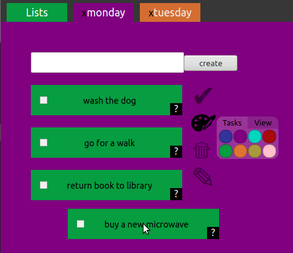

# nickscoolproject
This is my first website. It works and does what I want it to do, but the code could be more readable and structured better. My next project will be more readable and have better structure by design.

## About
Nickscoolproject.com is a to-do list website where users login to create, organize and keep multiple to-do lists online. Users can drag and drop tasks of a list to re-order them. The order of tasks in each list is saved on the back-end. Users may change multiple tasks or lists at the same time. This action also updates the backend and makes use of djangos 'bulk_update' feature. The website features a nav bar which contains tabs for each list, which can be opened and closed, similar to tabs in a web browser.

https://www.nickscoolproject.com



## To Run Locally
This website uses python 3 and the django framework for the backend. 
To begin you should install python 3 and pip3.
```bash
sudo apt-get install python3
sudo apt-get install python3-pip
```
Then you should install a virtualenv to install the required python dependencies in.
You can use either one of these commands
```bash
sudo apt-get install python3-virtualenv
```
or
```bash
pip3 install virtualenv
```
Then enter the root directory of the project folder, which is named 'todo-list'
```bash
cd todo-list
```
create the virtual environment by entering
```bash
virtualenv env
```
To begin using the virtual environment, enter
```bash
. env/bin/activate
```
or
```bash
source env/bin/activate
```
If everything has worked so far, then from here you should install the python libraries .
used in this project by entering:
```bash
pip3 install -r requirements.txt
```
Not everything in this text file is necassery, but may be of use. eg: django-corsheaders, which
enables you to send ajax requests without being on the website. This can be of convenience for testing.

From here you may go the backend directory to set up the database and run the server.
```bash
cd /backend
python3 manage.py makemigrations
python3 manage.py migrate
python3 manage.py runserver
```
If no errors occur, you can open your browser and enter http://localhost:8000 to use the site.

### Modifying The Frontend
Frontend code is maintained in the /frontend/src/ directory using react. If you wish to modify the frontend code, you will have to install some npm packages to compile the code into a react build, which should then be placed in the backend folder to serve to the client. 

I have created a script to automate the building process called build.sh in the /frontend/src/ directory. It deletes the build currently in the backend folder, then creates a new one, which is then placed in the backend to replace the old one. It also moves static files in places they need to be.

But before you use this script, you must install node and npm. You should download and install npm from [here](https://nodejs.org/en/download/) instead of using the apt package manager because it often installs very old versions. 

After installing node and npm, you should be able to use the build script in the /frontend/ directory by entering:
```bash
./build.sh
```
## Structure
Inside the root folder are /backend/ and /frontend/ directories. Django python code and settings are maintained in /backend/ and React javascript code and settings are maintained in /frontend/.

/frontend/ is where the files used for frontend development are. the frontend sourcecode is in /frontend/src/.
/backend/ is the root directory for django app, and holds a compiled version of the source code in the frontend directory to send to the client as well as backend settings and code.

```
frontend
├── src
│   ├── App.js                      main react file, logic for which view to show
│   ├── App.test.js                 
│   ├── components                  folder containing all react components
│   │   ├── CheckBox.js             custom checkbox 
│   │   ├── ListButtons.js          clickable rectangle, which opens a NavTab
│   │   ├── ListsTab.js             special NavTab that takes user to the ListView
│   │   ├── ListView.js             main view, which displays todo-lists as ListButtons
│   │   ├── NavBar.js               contains ListTabs at the top of the page
│   │   ├── NavTab.js               like a browser tab. takes the user to individual todo-list
│   │   ├── Registration.js         login and registration view
│   │   ├── TaskButton.js           black '?' button on tasks used to open descriptions
│   │   ├── Task.js                 individual entries contained in todo-lists
│   │   ├── ViewButton(sidebar).js  user actions: delete, rename, re-colour, complete
│   │   └── View.js                 view for individual lists. displays its tasks
│   ...
├── public                          contains static files
├── node_modules                    
├── build.sh                        compiles code and moves it to the correct backend folder 
├── package.json                    
└── package-lock.js                 

backend
├── backend                         
│   ├── asgi.py                     not used in this project
│   ├── __init__.py         		
│   ├── settings.py                 django settings: selecting middleware, DB connection, etc
│   ├── urls.py                     url routing
│   └── wsgi.py                     http requests to python object, vice versa
├── manage.py                       django console/shell commands
└── todolist                        application code
    ├── admin.py                    
    ├── apps.py                     
    ├── __init__.py                
    ├── migrations                  
    ├── models.py                   
    ├── serializers.py              validation checking
    ├── templates                   
    │   └── build                   contains compiled react code
    ├── tests.py                    
    └── views.py                    logic that handles all requests
```
